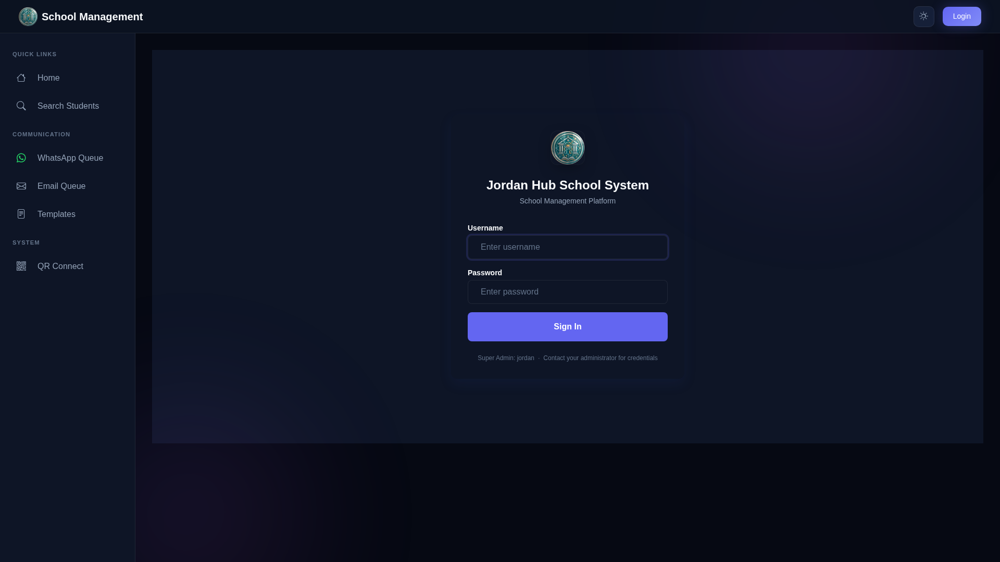

# 🎓 JD Hub School Management System


A comprehensive, offline-first school management system built by **Jordan Design Hub (JD Hub)**. Manage students, teachers, fees, marks, reports, and parent communications - all from a single, secure desktop application.

---

## 🔷 About JD Hub

**Jordan Design Hub (JD Hub)** is a software development company specializing in educational technology solutions for African schools.

- **Developer**: Jordan Design Hub
- **Contact**: +256 754 687 597
- **Email**: jordandesignhub@gmail.com
- **Location**: Uganda

---

## 🎯 Key Features

| Feature | Description |
|---------|-------------|
| **Offline-First** | Works without internet! Perfect for areas with unreliable connectivity |
| **Single-Device Security** | Hardware-bound licensing (HWID) prevents unauthorized copying |
| **Smart Reports** | Automated report cards with analytics and performance tracking |
| **Fee Management** | Complete financial management with receipts and balance tracking |
| **Free Messaging** | WhatsApp and email notifications at no cost |
| **QR Parent Kiosk** | Parents access reports via QR code scan |
| **Role-Based Access** | 9 distinct user roles with appropriate permissions |
| **Hybrid Backup** | Local, USB, and cloud backup options |

---

## 🖼️ Screenshots

### Landing Page


### Master Vendor Dashboard


### License Status


### School Admin Dashboard


### WhatsApp Queue


### Student Management


### QR Connect


### Parent Kiosk


---

## 👥 User Roles (RBAC)

| Role | Access Level |
|------|-------------|
| **MASTER_VENDOR** | Software owner - full system control |
| **SCHOOL_ADMIN** | User management, settings, backups |
| **HEAD_TEACHER** | Executive dashboard, report approval |
| **DOS** | Terms, timetable, grading, exams |
| **ACCOUNTANT** | Fee management, receipts |
| **SECRETARY** | Student registration, admissions |
| **CLASS_TEACHER** | Class dashboard, termly returns |
| **SUBJECT_TEACHER** | Marks for assigned subjects |
| **PARENT** | Read-only kiosk access |

---

## 🛡️ Licensing & Security

### Single-Device HWID Lock
The system calculates a unique Hardware ID (HWID) from:
- CPU ID
- Disk Serial Number
- MAC Address

If the database is copied to another machine with a different HWID, access is automatically locked.

### Feature Matrix Keys
Encrypted license keys control:
- Expiration Date
- Max Active Users
- Feature Flags (FEES, PHOTOS, A4_IDS, KIOSK, PDF_PREVIEW, EXAMS)

---

## 🚀 Quick Start

### Prerequisites
- Python 3.10+
- Chrome/Chromium browser (for screenshots)

### Installation

```bash
# Clone the repository
git clone https://github.com/Mubogi/school-management-system-main.git
cd school-management-system-main

# Install dependencies
pip install -r requirements.txt

# Run migrations
python manage.py migrate

# Start the server
python manage.py runserver 0.0.0.0:8000
```

### First Run Setup
1. Open http://localhost:8000/setup/
2. Enter initial admin credentials (default: Jordan / 20020120)
3. Configure your school details
4. Login and start using the system

---

## 📱 Portals

| Portal | URL | Purpose |
|--------|-----|---------|
| Staff Login | `/accounts/login/` | Staff authentication |
| Parent Kiosk | `/parent-kiosk/` | Parents view reports & fees |
| Mobile Connect | `/qr-connect/` | Generate QR for mobile access |
| License Status | `/system/license-status/` | View and upgrade license |

---

## 💬 Support

For technical support, licensing inquiries, or feature requests:

- **Phone**: +256 754 687 597
- **Email**: jordandesignhub@gmail.com
- **GitHub**: [Open an Issue](https://github.com/Mubogi/school-management-system-main/issues)

---

## 📄 License

Copyright © 2024 **Jordan Design Hub (JD Hub)**. All rights reserved.

This software is proprietary and licensed. Unauthorized copying, distribution, or use is strictly prohibited.

---

<p align="center">
  <strong>Powered by Jordan Design Hub (JD Hub)</strong><br>
  <em>Building the future of African education technology</em>
</p>
